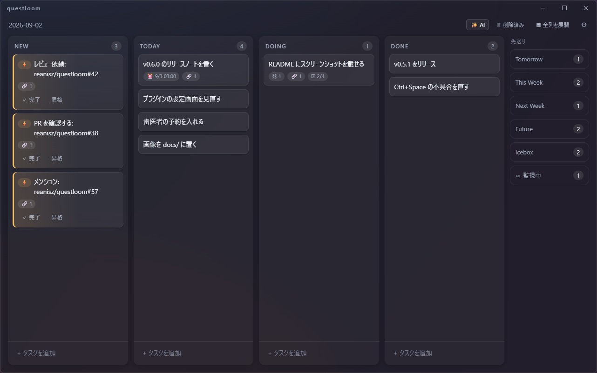
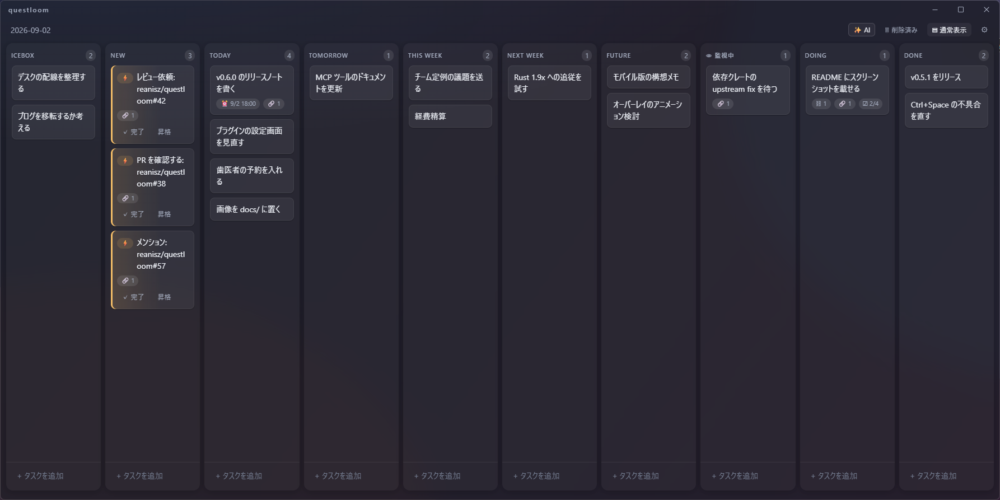
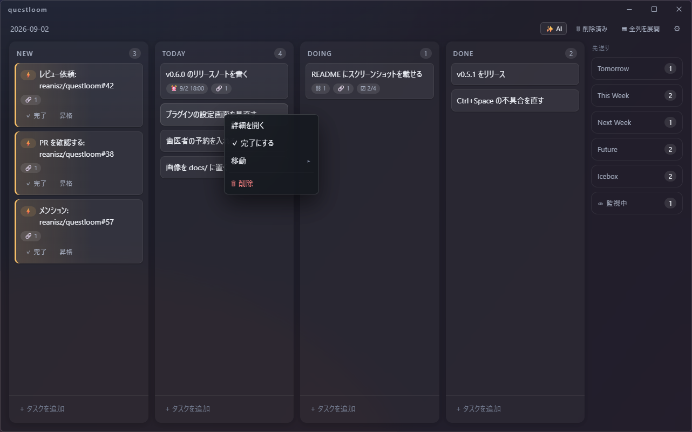
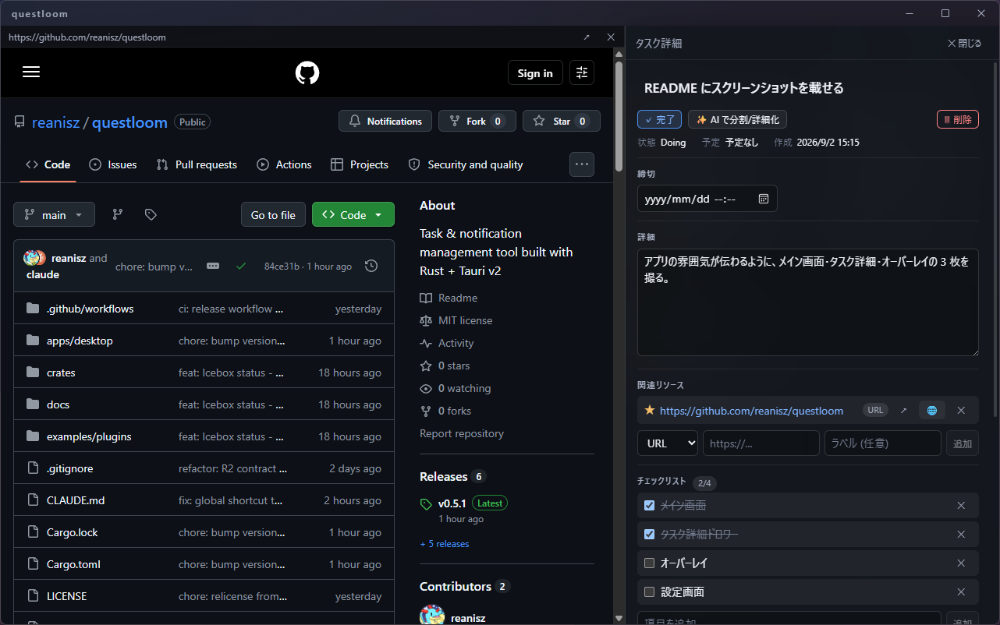
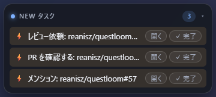
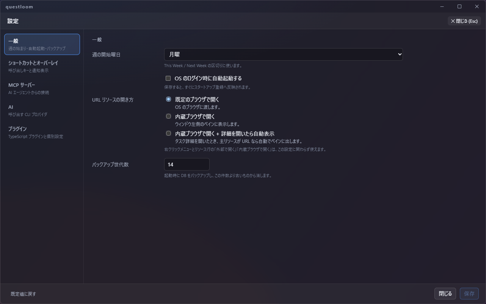

# questloom

**AI エージェントと一緒に使う、Windows 向けのタスクボード。**
Tauri v2 + React + Rust 製で、タスクトレイに常駐し、Ctrl+Space でいつでも呼び出せる。



- **「いつやるか」で並ぶ Trello 風ボード。** Today / Tomorrow / This Week / Next Week / Future の
  列は予定日から自動で導出されるので、日付が変われば勝手に繰り上がる。
- **AI エージェントがタスクを読み書きできる。** 内蔵の MCP サーバーに Claude Code / Codex を
  つなぐと、会話の中で「このタスクを分割して」「今日の分を並べ替えて」が通る。
- **外から降ってくる仕事は New 列に集まる。** GitHub のレビュー依頼・メンション・PR の CI 失敗を
  同梱プラグインが拾い、画面の隅のオーバーレイで知らせる。

## 画面

### ボードと先送りレール

普段は New / Today / Doing / Done の 4 列だけを広く見せ、Tomorrow 以降と Icebox・監視中は
右端のレールに件数付きの箱で畳んでおく。「全列を展開」で 10 列すべてを横並びにできる
(横スクロールは出ない)。



カードの右クリックで詳細・完了・移動・削除。ドラッグ&ドロップで列間の移動と並べ替えができる。



### タスク詳細と内蔵ブラウザ

カードをクリックすると右側にドロワーが開く。締切・詳細・関連リソース(URL / ファイル)・
チェックリスト・親子タスク・アップデート履歴をここで編集する。
リソースの URL は既定のブラウザのほか、**ウィンドウ左側の内蔵ブラウザ**で開ける
(設定で「詳細を開いたら主リソースを自動で表示」にもできる)。



### オーバーレイ

New 列にタスクがある間、画面左上に透過の小窓が出る。⚡ のインスタントタスクは
ここから「開く」「完了」がワンクリックで済む。ヘッダをクリックすると件数だけの
小さなインジケータに畳める。



## タスクの状態

| 列 | 意味 |
|---|---|
| **New** | 未分類。人が書いたものも、AI やプラグインが作ったものもまずここに来る |
| **Today / Tomorrow / This Week / Next Week / Future** | 予定日・予定週から導出される Todo。日付が変わると自動で繰り上がる |
| **Doing** | 着手中 |
| **Done** | 今日完了した分。前日以前の完了は列フッタの「過去の完了」から見る |
| **監視中 (Watching)** | 外部の変化待ち。MCP・AI・プラグインからの追記や子タスク作成を受けると自動で New に戻る |
| **Icebox** | いつやるかの判断ごと棚上げ。自動では起きない |

⚡ **インスタントタスク**は AI やプラグインが作る軽いタスクで、その場で完了するか、
「昇格」して通常の Todo に変えるかを選ぶ。

## AI エージェントとの連携

### MCP サーバー

アプリ起動中は `http://127.0.0.1:39150/mcp`(Streamable HTTP)で MCP サーバーが待ち受ける。
一覧・作成・移動・完了・履歴追記・チェックリストなど 15 のツールを持つ。Claude Code なら:

```powershell
claude mcp add --transport http questloom http://127.0.0.1:39150/mcp
```

Bearer トークンを設定して他のプロセスからの接続を絞ることもできる(値は Windows の
資格情報マネージャーに入り、DB には残らない)。

### AI CLI の呼び出し

ヘッダの「✨ AI」ボタンとタスク詳細の「AI で分割/詳細化」から、`claude` / `codex` の CLI を
直接呼ぶ。文章からのタスク抽出、タスクの子タスクへの分割、MCP 越しの自由指示の 3 つ。
プロバイダとコマンドラインは設定画面で差し替えられる。

## GitHub 統合(同梱プラグイン)

設定画面の「プラグイン」節で Personal Access Token を入れるだけで動く。

- 関連リソースに GitHub PR の URL を持つタスクを監視し、新しいコメントや CI の失敗を
  New 列のインスタントタスクとして知らせる(そのタスクが「監視中」なら、タスク自身を起こす)。
- 自分宛のレビュー依頼と、自分へのメンションを New 列に取り込む。
- PR の URL が付いた description の空のタスクに、PR のタイトル・状態・本文の先頭を書き込む。

プラグインは TypeScript 1 ファイルで書け、`%APPDATA%\dev.reanisz.questloom\plugins\` に
置くと読み込まれる。SDK の型定義は [apps/desktop/src/plugin-host/sdk.ts](apps/desktop/src/plugin-host/sdk.ts)、
サンプルは [examples/plugins/](examples/plugins/)。

## インストール

[Releases](https://github.com/reanisz/questloom/releases) から
`questloom-desktop_<version>_x64-setup.exe` を取ってきて実行する。
必要なのは Windows 10/11 と WebView2 ランタイム(Windows 11 は同梱済み)。

コード署名はしていないので、SmartScreen の警告が出たら「詳細情報」→「実行」で進める。

### 使い方のポイント

- **閉じるボタンはタスクトレイへの格納**。終了はトレイアイコン右クリック →「終了」。
- **Ctrl+Space** でどこからでもボードをトグル(設定で変更可)。
- データは `%APPDATA%\dev.reanisz.questloom\data.db`(SQLite)。起動ごとに `backups\` へ
  バックアップが取られる(既定 14 世代)。
- 設定はヘッダ右端の歯車から(週の開始曜日・ショートカット・自動起動・URL の開き方・
  MCP・AI プロバイダ・プラグイン)。



## ソースからビルドする

- [Rust](https://rustup.rs/) stable(`x86_64-pc-windows-msvc`)
- Node.js(LTS 以降)+ npm
- Visual Studio の「**C++ によるデスクトップ開発**」ワークロード
  (MSVC v143 + Windows SDK。無いとリンクエラーでビルドできない)

```powershell
git clone https://github.com/reanisz/questloom.git
cd questloom\apps\desktop
npm install
npm run tauri build
```

初回ビルドは 10 分前後かかる。成果物は 2 つ:

| 用途 | パス |
|---|---|
| インストーラ (NSIS) | `target\release\bundle\nsis\questloom-desktop_<version>_x64-setup.exe` |
| ポータブル実行ファイル | `target\release\questloom-desktop.exe` |

ビルドせずに試すなら `npm run tauri dev`。

## ライセンス

[MIT License](LICENSE)

## ドキュメント

- [アーキテクチャ設計](docs/architecture.md)
- [データモデル設計](docs/data-model.md)
- [実装ロードマップ](docs/roadmap.md)
- [テスト戦略](docs/testing.md)
- [開発ガイド (CLAUDE.md)](CLAUDE.md) — ビルド/テストコマンドの一覧、設計上の注意
